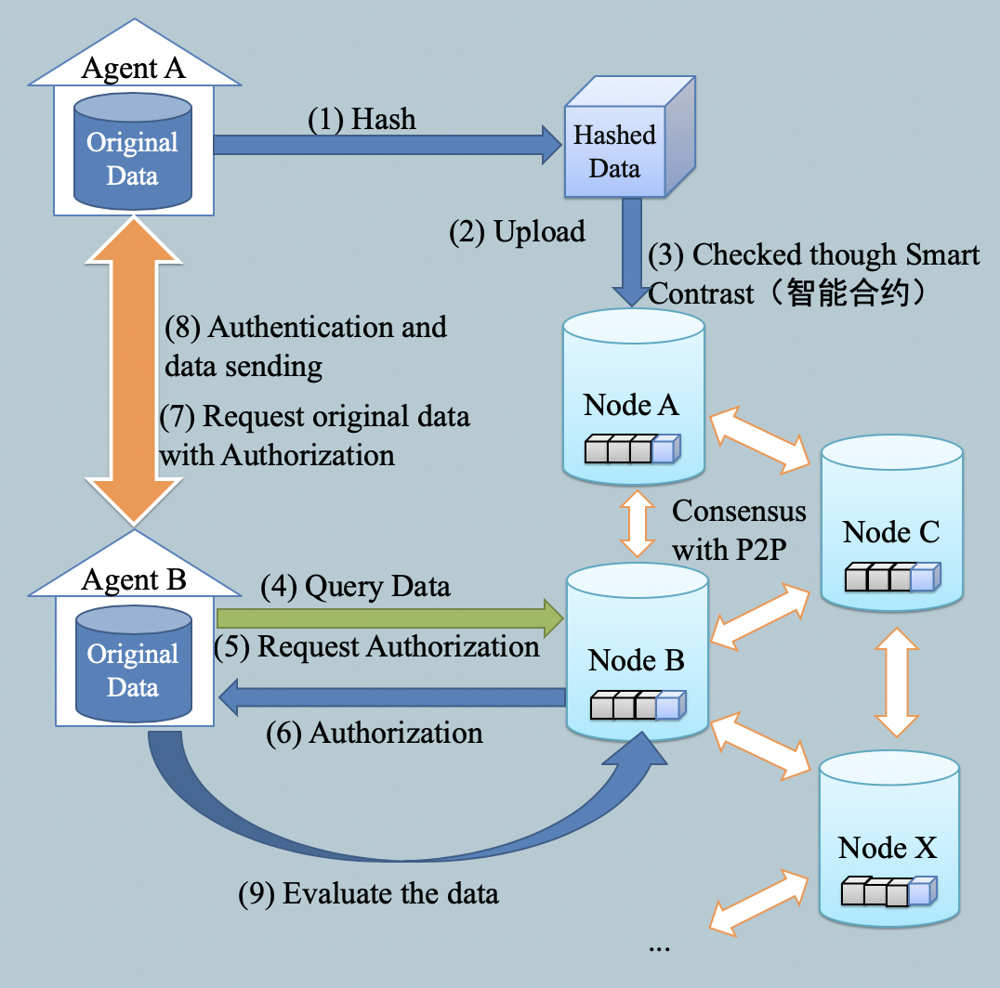

# openCredit

基于 [FISCO-BCOS](https://github.com/FISCO-BCOS/FISCO-BCOS) 区块链平台开发的去中心化征信数据平台。

## [API Document](./API.md)

## 背景

征信系统一方面可以实现了金融类信息的共享；另一方面可以通过加工数据，协助用户控制风险。处理征信数据的技术关键在于数据整合、数据挖掘和评级模型。

而目前我国个人征信业务仍处于起步阶段，以公共征信机构为主导，民营征信机构有限。由于各家机构的基因不同，因此在数据收集、评分体系方面也截然不同，相互间缺乏共享渠道和机制。

在此背景下，此项目的目的是建立一个覆盖所有与互联网金融发生联系的个人和企业、允许任何互联网金融机构接入的公共征信服务平台。

## 使用区块链技术的动机

区块链技术的发展使得这一领域产生了新的突破。由于其交易公开透明、安全可靠、难以篡改，并且自带时间戳属性，将区块链技术用于征信数据交易授权具有可行性。通过搭建联盟链的形式，由数据供方在本地存储数据，同时将数据摘要按照既定规则上链。同时为了保证数据信用评级的公平性，根据各个机构提供的数据查询次数和数据有效性，给予不同的数据信用分。这种方法搭建下的体系中，无需改变现有业务流程，并且授权记录可实时更新。随着区块链技术的发展和应用场景的不断增加，区块链技术未来还有可能在征信数据交易行业中发挥更大的作用。

## 项目架构设计

说明：

1. `Agent A`/`Agent B` 代表两个征信机构，如果它们想要在 `openCredit` 共享数据的话，那么它们就需要申请加入平台的**联盟链**，等待平台审批完成之后才能获取到认证证书（包括私钥），连接上平台的联盟链的网络。
2. 流程（1）（2）（3）：上传者（如机构A）上传征信原始数据的 Hash 到区块链上，与身份证 ID 的 Hash 进行关联。
3. 流程（4）：获取者（如机构B）如果需要查询某人的征信数据，可以通过身份证 ID 的 Hash 值进行检索。
4. 流程（5）：找到合适数据后，获取者调用`智能合约(Smart Contract)`请求征信原始数据，请求记录在区块链上。
5. 流程（6）：上传者审批请求，结果记录在区块链上。
6. 流程（7）：获取者线下通过 HTTPS 请求上传者后台接口请求原始数据，并传Token参数（自己公钥加密后的链上请求记录的ID）
7. 流程（8）：上传者收到数据请求之后验证Token并根据结果发送原始数据。
